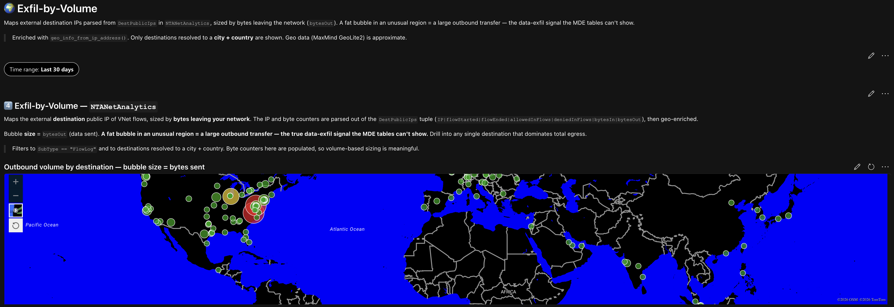

# 🌍 Microsoft Sentinel SIEM — Geo Map 3: Exfil-by-Volume

Part of a broader **Microsoft Sentinel SIEM** portfolio series. This workbook visualizes outbound data volume by destination, surfacing the signal that logon and process telemetry alone can't show: **how much data is actually leaving the network, and where is it going.**

## Platforms and Languages Leveraged

- Microsoft Sentinel / Log Analytics Workspace
- Azure Network Watcher (`NTANetAnalytics` — VNet flow log analytics table)
- Kusto Query Language (KQL)
- Azure Monitor Workbooks (native `geo_info_from_ip_address()` geolocation, MaxMind GeoLite2 data)

## Scenario

Endpoint telemetry like `DeviceLogonEvents` and `DeviceNetworkEvents` shows *who connected where*, but not *how much data moved*. A compromised host quietly staging and uploading gigabytes to an external server can look unremarkable in connection-count terms while representing a serious data-exfiltration event. This workbook answers: **which external destinations are receiving the largest volumes of outbound data, and where are they located?**

## What the Workbook Does

- **Time range parameter** — same pill selector pattern (1hr → 30day), defaulting to 30 days since volume anomalies often need a longer baseline to stand out.
- **Bubble map** — plots each external destination IP by geolocation, with bubble **size and color** scaled to total `bytesOut`. A large bubble in a region with no legitimate business reason to be receiving data is the signal to investigate.
- **Companion table** — same destinations ranked by total bytes out, converted into MB/GB/TB for readability, plus the number of distinct internal source hosts feeding each destination (a concentrated source fan-out into one destination can indicate exfil staging).

## Query Logic

Both visuals query `NTANetAnalytics`, Azure's VNet flow log analytics table, and unpack its `DestPublicIps` field:

- **Data source distinction** — unlike Geo Maps 1 & 2, this workbook doesn't use Defender for Endpoint tables. `NTANetAnalytics` is a network-flow-level table with real byte counters, which is what makes volume-based analysis possible here.
- `SubType == "FlowLog"` — the only externally-meaningful subtype in this table.
- **Tuple parsing** — `DestPublicIps` packs multiple fields into one delimited string (`IP|flowStarted|flowEnded|allowedInFlows|deniedInFlows|bytesIn|bytesOut`); the query splits on `|` and extracts each position by index.
- `BytesOut > 0` — scopes to flows that actually carried outbound data.
- `geo_info_from_ip_address()` — enriches the destination IP with country, city, and lat/long; rows that don't resolve to both a city and country are dropped, since bubble accuracy matters more here than raw completeness.
- Aggregated **per destination IP**: summed bytes out/in, distinct source host count, and the set of destination ports used.
- Bytes are converted to MB (`round(BytesOut / 1048576.0, 1)`) for a human-readable map label.

```kql
NTANetAnalytics
| where TimeGenerated {TimeRange}
| where SubType == "FlowLog"
| where isnotempty(DestPublicIps)
| extend Parts = split(DestPublicIps, "|")
| extend PublicIp     = tostring(Parts[0]),
         AllowedFlows = tolong(Parts[3]),
         DeniedFlows  = tolong(Parts[4]),
         BytesIn      = tolong(Parts[5]),
         BytesOut     = tolong(Parts[6])
| where isnotempty(PublicIp)
| where BytesOut > 0
| extend geo = geo_info_from_ip_address(PublicIp)
| extend Latitude  = toreal(geo.latitude),
         Longitude = toreal(geo.longitude),
         Country   = tostring(geo.country),
         City      = tostring(geo.city)
| where isnotempty(City) and isnotempty(Country)
| where isnotempty(Latitude) and isnotempty(Longitude)
| summarize BytesOut = sum(BytesOut),
            BytesIn  = sum(BytesIn),
            Sources  = dcount(SrcIp),
            Ports    = make_set(DestPort, 15)
         by PublicIp, Country, City, Latitude, Longitude
| extend MB_Out = round(BytesOut / 1048576.0, 1)
| extend MapLabel = strcat(PublicIp, " (", City, ", ", Country, ") - ", MB_Out, " MB out, ", Sources, " sources")
| project Latitude, Longitude, MapLabel, BytesOut, MB_Out, BytesIn, Sources, Ports, PublicIp, Country, City
| order by BytesOut desc
```

> Geo data (MaxMind GeoLite2) is approximate — read the map as regions, not pinpoints.



## How to Use

1. Open **Microsoft Sentinel** → **Workbooks** → **Add workbook** → **Advanced Editor** (`</>` icon).
2. Delete the placeholder JSON and paste in the contents of [`workbook.json`](./workbook.json).
3. Update `crossComponentResources` and the `context.ownerId` field to point at your own Log Analytics workspace resource ID.
4. Confirm **Azure Network Watcher Traffic Analytics** is enabled on your VNets — `NTANetAnalytics` only populates once Traffic Analytics is turned on.
5. Save, then apply the workbook to your workspace.
6. Adjust the **Time range** pill to control the lookback window; volume-based anomalies often need a wider window than logon or connection anomalies to surface clearly.

## Repository Contents

| File | Description |
|---|---|
| [`workbook.json`](./workbook.json) | Full Azure Monitor Workbook definition — import directly into Sentinel |

## About

Built as a lab exercise against a Log Analytics workspace (`LAW-Cyber-Range`). Part of a growing Microsoft Sentinel SIEM workbook series covering inbound authentication, outbound connections, data exfiltration indicators, inbound threat intel correlation, and threat intelligence ingestion (manual + Microsoft feed).
